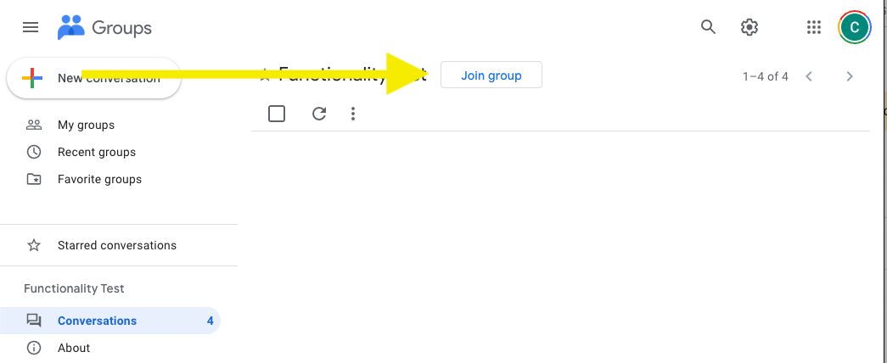

# {{ page.title }}

This documents how to join and leave a Google Group via webpage and email.

If you have any issues following the guides below please reach out to us at [support@osg-htc.org](mailto:support@osg-htc.org) with the email you would like subscribed and the list you would like to subscribe too.

##### Contents

- [Joining a list via webpage](#joining-a-list-via-webpage)
- [Leaving a list via webpage](#leaving-a-list-via-webpage)
- [Joining a list via email](#joining-a-list-via-email)
- [Leaving a list via email](#leaving-a-list-via-email)

## Joining a list via webpage

To join a group via the Google Groups UI you should:

1. Login to google account you wish to subscribe.
    - If you don't wish to subscribe via Google account see [below](#joining-a-list-via-email).
1. Navigate to the groups page at ```https://groups.google.com/u/1/a/osg-htc.org/g/[Group Name]```.
    - For example group **osg-group**: <br> ```https://groups.google.com/u/1/a/osg-htc.org/g/osg-group```.
1. Click on the button marked "Join Group" (Shown Below).

#### Notes:
- This method requires the group is open to the public and a Google Associated email address

{: .img-fluid }

## Leaving a list via webpage

1. Login to subscribed email account via Google.
2. Select group from the ["My Groups" page](https://groups.google.com/my-groups).
3. Click "My membership settings".
4. Click "Leave Group" button found in the same location as the "Join Group" button above.

## Joining a list via email

To join a Google Group via email, send an email to [Group Name]+subscribe@osg-htc.org.

For example, to join the group called osg-group@osg-htc.org, send an email to osg-group+subscribe@osg-htc.org.

If this feature is available, you will receive an email with the following information:

{: .text-info }
```
We received your request to join [Group Name].

In order for us to complete the request, please reply to this email or click
[the button] below.

[Join This Group]
```

#### Notes:

- Always reply to the email to join. Clicking the button is inconsistent and will sometimes give an error of "you do not have permissions to access this group".

- You should send the subscribing message from the email address you want to receive messages. The above instructions need only be used for those without direct access to Google Groups at https://groups.google.com/a/wisc.edu/forum/#!myforums.

- For some groups, you may need to confirm the subscription request, as delineated above, while other with more restricted membership will require the group owner to approve your subscription request before you can join.

## Leaving a list via email

To leave a Google Group via email, send a blank email to [Group Name]+unsubscribe@osg-htc.org.

In the standard convention, it should look like osg-group+unsubscribe@osg-htc.org.

If it is successful, you should receive an email with the following Subject Line and Content:

{: .text-info }
```
Your unsubscription to [Group Name] was successful.
```

#### Note: 
- It may take some time for the unsubscribe request to go through.
